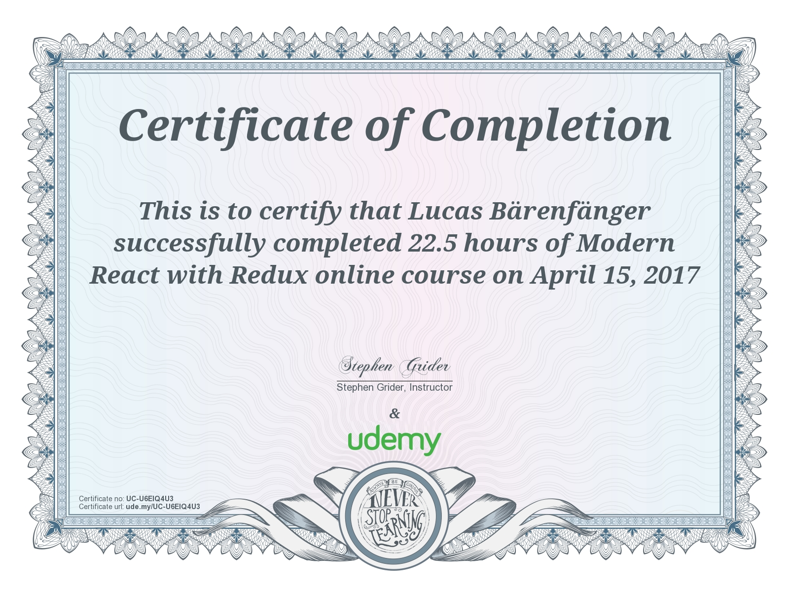

> ### 🚨 My GitHub account name and domain have changed since I created this repository!
> **When I originally created this repository, my GitHub account was `@lambdarookie` and my domain was `lambdarookie.com`.
> These might be referenced within this repository.
> Note that my current GitHub account is `@lkbaerenfaenger` and my current domain is `lkbaerenfaenger.com`.**

# react-redux-2017-course-notes

**Notes on and source code from the Udemy course "Modern React with Redux" (2017 edition) by Stephen Grider**

:point_right: This repository represents the 2017 edition of the course, which I completed entirely.
I also completed some of the projects of the course's 2019 edition.
Those can be found within [this repository](https://github.com/lambdarookie/react-redux-2019-course-notes).

---

* The contents of this repository are originally based on the Udemy course [Modern React with Redux (link to 2019 edition as 2017 edition is not available anymore)](https://www.udemy.com/react-redux/) by Stephen Grider ([@StephenGrider](https://github.com/StephenGrider), [rallycoding.com](https://www.rallycoding.com/)).
  This repository only represents a fraction of what is to be found within the course.
  Also, this repository contains many additions and comments that are not part of the course.
* The original repository can be found [here](https://github.com/StephenGrider/ReduxCasts).

---

1. [Usage](#1-usage)
2. [Progress](#2-progress)
3. [Certificate](#3-certificate)

---

## 1. Usage

Navigate into the directory of interest, e.g., the `section_3_and_4_book_browser` directory, and do `npm install`, followed by `npm start`.
Then, browse to http://localhost:8080/.

## 2. Progress

|  Done?             | Name                                        | Sections         |
|:------------------:|---------------------------------------------|------------------|
| :white_check_mark: | [`book_list`](section_3_and_4_book_browser) | Sections 3 to 4  |
| :white_check_mark: | [`weather`](section_5_forecast_browser)     | Section 5        |
| :white_check_mark: | [`blog`](section_6_blogging_app)            | Section 6        |
| :x:                | `video_browser`                             | ?                |

:point_right: I implemented the `video_browser`, too, but for some reason I did not import it from my old GitHub account along with the other projects.

## 3. Certificate

